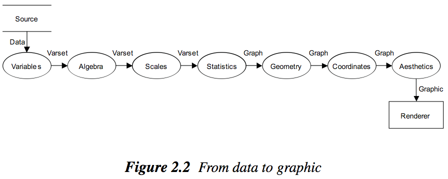
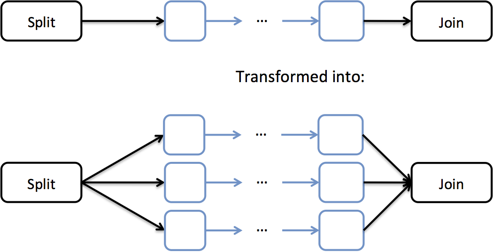

# gg-js implementation notes

## Background

### Grammar of Graphics (GoG)

Grammar of graphics defines a set of orthogonal components that are involved in producing a graphic.  At a high level, a graphic is created via the following discrete steps:

0. Ingest a dataset
1. Variables: Define variables from dataset (a variable is like a column in a table)
2. Algebra: Use algebraic operators (\* / +) to compute cross products, nesting, and concat variables
3. Scales: Map variables to numerical domain (strings to numbers, apply log transforms etc)
4. Statistics: compute statistics over the data
5. Geom: map statistics to generic geometrical objects
6. Position: modify positioning of geometries (e.g., add jitter to scatter plot points)
6. Coord: transform geometries based on a coordinate system (maps, polar, etc)
7. Aesthetics: add color, texture, and other aesthetic properties
8. Render the graphic (e.g., onto canvas or svg element)

The purpose of such a grammar is to promote fast data analysis iterations:

- Visualization systems that assume an external process transforms and analyzes the data, and simply preforms rendering does not allow the analyst to e.g., view the same analysis under log transformations
- Wilkinson argues that the Vis system must control the transformation and analysis steps as well.  (note: the data is largely assumed to be clean)

### ggplot2

In the R library ggplot2, graphics are decomposed into the following components:

1. Data: an R data.frame.  Think database table with attribute names, dynamic typing, and tuples.
1. Facets: Define the 2 dimensional faceting to render a grid of subplots
1. Layers: Defines the statistical transformation, aesthetics, and geometry (e.g., line, point, etc) to be rendered in a single "layer"
1. Scales: x, y scales.  Ensures that domain and range of rendered data is consistent across layers and facets.
1. Coordinates: The coordinate system e.g., polar, map, euclidian.

The processing workflow is roughly:

1. Facet definition partitions the data by the facet variables.  
    * Each partition is processed independently and turns into a subplot
2. Scales transform attributes (log transformations)
2. A grouping specification may further split the partition into groups
    * This is so multiple lines can be plot (e.g., one curve for each department in a school) 
3. Statistics (e.g., sum, count, smoothing function) are computed on each of the groups 
    * e.g., total cost for each of the departments
4. Aesthetics map the attributes output from Statistics to geometry parameters (e.g., pressure -> x coordinate)
4. Scales are trained so that the domains of the X and Y axes are consistent.
5. The plot title, subtitle, etc are rendered
8. Facets allocate space for each subplot, and draws the facet labels
5. Scales ranges are mapped to pixel lengths
6. Scales are used to compute geometry parameters (e.g., x,y location, width of rectangle)
7. Coordinates transform geometry parameters into a different coordinate space
8. Geometries are rendered in each subplot
9. Axes are rendered
10. Guides (legends) are rendered

The downside to this model is that the code is difficult to understand and extend.  The data flow is not apparent, and the execution steps are not trivially mappable to the R code specification.

## gg-js

gg-js also uses the concept of layers, which defines how a single geometry type is rendered from the data.  In contrast to ggplot2, a layer's rendering pipeline is explicitly modeled as a workflow.

The rendering jobs are separated into:

1. Rendering title, subtitle, legends
2. Rendering facets, which allocates space for each subplot
1. Rendering geometries in the layers of a subplot (e.g., lines, points)
2. Rendering axes for each subplot

The bulk of the work lies in (4), which needs to transform data, compute statistics, and render geometric objects.  In the process, it also *trains the scales*, meaning it computes the domains and ranges of each aesthetic component (e.g., the domain of the x,y variables), which is necessary to know how to render the axes and legends.  This is implemented with a generic workflow that is compiled from high level specifications.  The workflow is presented next.

### Data Model

The data model are nested relational tables of up to two levels.  The schema supports the standard types  (int, float, string, datetime, function), or a schema of the standard types only.  The function type returns a int/float/string/dattime type when executed at access time.  Function columns enable values are decided at runtime (e.g., a slider that sets a parameter used by a function).

This is similar to PIG's model.

### Rendering a Layer (low level)

The observation is that every step in ggplot2's/grammar of graphics' pipeline involves data/schema transformations.  In other words, each step takes as input a structured dataset, and outputs another structured dataset.  The operators are:

* *XForm*: transforms an input table into an output table and have a well-defined input and output schema.  
* Special classes of XForm operators include
    * *Map*: mapping one schema into another schema.  Useful for mapping an output table to an operator's input schema.
    * *Identity*: Transforming one or more columns but keeping the same schema
* *Split*: partitions the dataset by a value of a grouping function.  The rest of the transformations until the paired *Join* operator are duplicated and executed on each partition independently.
* *Join*: Paired with a *Split* operator.  Concats the transformed partitions into a single table, and adds a column that identifies tuples from each partition.  Note: a *split* followed immediately by a *join* does not return an identical table because join adds a column for the partition ids.
* *Collect*: Takes N input tables and outputs N (possibly transformed) tables.  
* *TrainScales*: Takes the output of all instances of the previous operator, and feeds each transformed dataset to the corresponding instance of the subsequent operator (This will be apparent in the next section)
* *Placeholder*: Wraps around a subset of the workflow to provide it with a name.  Used by facetting to dynamically replace portions of the workflow.  For example, a noop placeholder named "sampler" may be replaces with operators that implement different sampling techniques.  

The following diagram shows a static specification of *Split* and *Join* is transformed into the executed workflow.  A separate instance of the blue workflow is created for each of the 3 partitions.

The following defines a single layer's transformation workflow:

    layer: [ 
        {xform: "log", base: 10, var: "x"}      // outputs same schema as input table
       ,{xform: "applyscales"}                  // apply scale transformations (e.g., log10)
       ,{xform: "trainscales"}                  // train scales

       // The following are statistical transformations
       ,{xform: "split", on: "a"}               // Computing separate histograms for each value of "a"
       ,{xform: "bin", x: "x", binwidth: 10}    // computes histogram w/bucket size 10
                                                // output schema: [x, binwidth, count]
       ,{xform: "join"}                         // concat outputs of xforms since most recent "split" operation
       
       
       // The following are geometry related transformations
       ,{xform: "trainscales"}                  // train the scales' domains from the transformed data
       ,{xform: "geom-box"}                     // transform data table into {x, width, height} box schema
       ,{xform: "stack"}                        // update 
       ,{xform: "facetrender"}                  //
       ,{xform: "coord-polar"}
       ,{xform: "geom-box-render"}              // Render the boxes
           ]

### Mid-level Architecture

Naturally there are distinct steps and an order to the workflow.  Below is an example of a concrete workflow that generates a faceted graphic consisting of a single layer:

There are three major sub-workflows: Statistics, Geometry/position, Coordinates

* Facets define a grid of subplots, each with a partition of the data (e.g., partition by university).  The workflow is replicated and executed for each partition.  
* While each partition is largely processed independently, there are two points of coordination (Scale1, Scale2) to synchronize the Scales objects.  
* Univariate transforms may modify the values of a single column (e.g., apply a log scale's log transform), or add additional columns to the table.  
* The Stats component computes statistics (e.g., total number of students by department) and may execute an internal workflow (e.g., split by department, then count the students each of the sub-partitions).  
* After the statistics are computed, the schema and data values may have changed (the y axis is a count rather than a column in the original table), so the scales need to be re-trained.  
* Finally, the blue boxes turn the data table into a standardized geometry schema (geom), update the positionings of the geometries (position), transform the coordinates (coord), add color/texture/etc, and finally render the geometries.

#### Facets

?

#### Univariate Transforms

These include such as defining new columns, scaling columns, filling in null values, etc.  

Schema changes are incremental: 1) no changes 2) adding column 3) renaming column 4) removing column

The key points is that there are two types of scalings:

1. Transform values using functions or math expressions.  For example `log(column)`
2. Transform the values using the Scales.  For example, `x-scale.transform(column)`.  The key difference from `log(column)` is that the transformation is invertable so that labels in pre-transformed units can be rendered.

??? How does the system know which `column` to use in `x-scale.transform(column)`?

#### Scales

Scales map variable values to values of aesthetic attributes (e.g., x, y, color, fill, width, alpha, size) and are responsible for generating labels, axes, and legends.  Although the data in each facet may have different value ranges, so that each subplot and each layer may compute a unique set of scales, users typically expect to see a single consistent legend, and that axes are consistent across subplots.  Thus Scales must be computed across subplots and layers.

Scale1 is used so statistics can be computed consistently for each partition.  For example, so that histogram bucket sizes are the same across subplots.

Scale2 is used because the final aesthetic scales may be defined over summary statistics (e.g., count of students).  Thus the units/value range of the scales need to be re-calibrated.

#### Stats

Compute arbitrary statistics.  The operators may define input and output schema requirements, and *Map* operators may need to be used to map an input table to the required input schema.

#### Geom

Map the statistical summaries into a schema understood by the rest of the components.  The schema includes variants of [x, x0, x1, y, y0, y1, width, height, color, size, fill, alpha, texture, etc].  Each output tuple represents the data to render a single graphical element (point, rectangle, line, etc)

This is likely a wrapper around a dynamically generated *Map* operator. 

#### Position

Reposition geometries in response to overlap.  For example, adding jitter to a scatter plot, or stacking bars in a bar plot.  Another use is to create [dotplots](http://www.cs.uic.edu/~wilkinson/Publications/dots.pdf) -- more informative variants of histograms that render each tuple as a circle, and stack overlapping circles.

The schema does not change.

#### Coordinate Transform

The input schema contains positional columns (e.g., x, y, x0, x1, y1, y2).  These columns are transformed based on the coordinate -- either flipped, transposed, reversed, or polar coordinate.

It's not clear what the schema for supporting polar coordinates looks like

#### Aesthetics

### High-Level Feature Requirements 

#### Facets

* 1D wrap, 2D grid, or nested (to support mosaics p. 343 GoG)
* Pixels allocated to subplots can be equi-sized or varied by value range of subplots' data
* Can facet on 
    * different workflow implementations (facet by sampling techniques)
        * User defines different workflows with the *same schema* to replace a placeholder.
    * set of variables (to compare variables) 
        * (XXX: this is equivalent to pivoting the table  and a normal facet?)
    * partitioning function (to compare different, possibly overlapping, segments of a time series)
    * a xform operator's parameter (histogram binwidth)

#### Scales

Scales are non-trivial because they interact with almost every component.

**Maybe just have two sets of scales?  Or type/scale the columns and throw it all away for the second retraining.**

* Need scales for each layer, subplot, and overall graphic 
* Positional scales need to track the correct label and value range 
    * User may say "y-scale is column X", but X may be transformed, renamed and summarized.  
    * Need provenance or a way to remove ambiguities.
    * e.g., for x-axis, start from geom-component and track schema mappings backwards to root column.
* Training scales across layers need to support conflicting data types and have sane defaults
* Training across subplots (due to facetting) depends on if subplots are equi-sized or variable sized
* Layer, Subplot, and graphic level scales accessible by all components
* Allowing facetting on a set of variables means the same y-scale may be trained on different variables.

#### Glyphs

Support to render points as glyphs (think sparkline style plot instead of a circle)

#### Labels

Text geometries and axis labels need to support smart layout to avoid overlap.

* Can detect its pixel size
* Can detect overlapping labels
* Understands possible options (move the label, shrink size of text) in response to overlap

#### CSS based styling

* Every individual and logical group of elements (labels, axes, ticks, geometries) can be referenced using css selectors

#### Interaction

* Selection
* Linked Brushing
* Linked panels separate from the main graphic
* Parametarized columns whose values are populated by a separate control (e.g., slider)
* Zooming in/out
* Drill downs, roll ups

# Schema and Detailed Descriptions

## Component

Join: 

## Graphic

    create scales
    create initial workflow (name different components)
    create facets
        partition data, split the workflow
        execute transforms
        apply scales
        train scales
        execute stats
        train scales
        update coords
        geom/position
        retrain scales
        
    

## Schema resolution

Given an input schema `(x:[func, colname])`, the component expects to be able to access 
a value for `x` from each tuple in the input table.  

The user may explicitly specify Since `x` may be specified as a function, a column name, or not 

## Data Table

Since the schema allows function type, try to execute function as late as possible.  Thus unless transformation accesses and uses value, just wrap functions.

**Need to differentiate arguments of function type, and proxy functions that should be executed to retrieve the actual value.  Create "proxyfunc" type?**

Table classes

    Table:
        @join(tables) -> table
        clone() -> table
        tuple(id) -> tuple
        val(id, attr) -> value
        type(colname) -> TYPE
        query(??) -> table
        split({groupname: keyfunc}) -> [tables]
        transform(colname, function) -> table
            clone().col.get(idx) = function(col.get(idx))
    
    Column:
        get(idx) -> tuple

    Tuple
        get(attr, default=null) -> value
        the get() may execute the function, provide a default value

## Facets

    facets: {
        x|y: "colname" | gb function | ["colname",…] | [ { "subflow_id" : subflow } ],
        scales: free | fixed,
        type: grid | wrap,
        sizing: free | fixed
    }

Grid/Wrap Facets need to facet on

* Column name
* Group by function
* List of variable names to map to a positional(?) scale.
* List of xforms to replace named subflows.  `{ subflow1: [[xforms], [xform2->xform3]] }`

## Scales

    scales: {
        #  aes: {range:[],  Scale(pre-stats-colname, post-stats-colname)
    }
    
    class scales(aes, post-aes, pre=null, range, domain)
        train()
        apply()
        

A Scale must define pre-stats and post-stats columns that it should be trained on.  Every scale defaults to identity.  

**XXX: Some logic needs to figure out pre-stats/post-stats from specs.**

* Pre-stats
    1. Train on original data
    1. Transform data to scale distribution
* Post-stats
    1. Lookup post-stats column
    1. Train on post-stats column if it has changed
* Post-position
    1. Train position (x/y) scales
* Accessible at any time from any module
* Distinct instances at
    * facetter level
    * subplot level
    * flow level
* Training at different levels
    1. Flow: read column data and set (min, max) for continuous, and unique values for discrete
    1. Subplot: union values of discrete scales across flows.  union of continuous limits across flows.
    1. Facet: 
        * All discrete scales from all subplots are unioned.  
        * Continuous Scales from each set of related subplots (row/column) are merged.  
        * Global set of non-positional scales merged.
    1. Note: positional scales able to tolerate continuous/discrete mix.  non-positional cannot.
* Rendering Guides
    1. Render non-positional scales that have alreday been trained and stored
    1. Render each positional scale in the right place.

Legends are rendered with 

1. Legend(nrows, ncol, maxwidth, maxheight, position, order)
1. Glyph(shape, stroke, fill, size, dx, dy, background)
2. Name(string)

## Statistics Schemas

Statistics are responsible for transforming, summarizing, and learning from the data.
Every statistics function can take a `group` function or column to independently run the stats function on each partition of the table.

If `group` is not specified, the grouping is defined as the cross-product of attributes in the table that are mapped to discrete aesthetic variables/ or are discrete.

A statistics component's job is to use the mapping parameters to 

1. define the grouping strategy
2. implement the aggregation
3. implement join logic (if any)

.

    Stats(args) extends Component
        get()            // access a parameter value.  If is a proxy function, execute and return result.
        exec()
        gbfunc() // figure out what the discrete types to split are
        stats()           // run on each partition
        join()           // 

Type resolution

1. Look for corresponding position scale.  Use if exists
2. Try to infer from data
3. Discrete

Generic summarization

* Collect(key: (tuple)->[keys], agg: (tuples)->tuple)
    * Compiles to split on key -> agg -> join
    * Can be used for: `bin, bin2d`
    * Output:    (keys, aggval, [ids])
* Sample(strategy='uniform')
    * Input:     (…)
    * Output:    (…)
* PixelSubsample(binwidth=scales.range()/30, mapping)
    * Input:     (x, y)
    * Output:    (x0, x1, [ids])

Specific functions post-split.

* Bin(binwidth=scales.domain()/30:float, mapping)
    * Input:     (x:[(tuple)->number,number])
    * Output:    (x0, x1, count, density, normalized count, normalized density)
* Bin2D(dx, dy, agg:(tuples)->number, mapping)
    * Input:     (x:[(tuple)->number,number], y: [(tup)->#,#])
    * Output:    (x0, x1, y0, y1, count, density, normalized count, normalized density)
* EquiBin(nx, ny, agg:(tuples)->number, mapping)
    * Input:     (x:colname, y:colname)
    * Output:    (x0, x1, y0, y1, count, density, normalizedcount, normalized density)
* Normalize(mapping)
    * Input:     (x:colnames)
    * Output:    (same schema)
* Boxplot(mapping)
    * Input:     (y:colname)
    * Output:    (median:float, q1-3:float, xvals:(x:colname))
* Density(kernel:func(adjust, etc), mapping)
    * Input:     (x:colname, y:colname or 1)
    * Output:    (x, y)
* Density2D(kernel, mapping)
* ECDF(mapping)
    * Input:     (x:colname)
    * Output:    (x, y)     // may need to interpolate to render steps?
* Function(f:(x)->number, n:int, min, max)
    * Input:     ()
    * Output:    (x, y)
* QQ(mapping)
* Smooth(function, n:int, mapping)
    * Input:     (x:[(d)->number,number])
    * Output:    (function)    // piped into Function component?
* Spoke(mapping)
    * Input:     (x, y, mag, theta, radius=1)
    * Output:    (x0, x1, y0, y1, radius)
* Sum(mapping)
    * Input:     (x, y, v=1)
    * Output:    (x, y, v:normalized float)
    * Internally needs to use scales or typing information to know if x &or y are discrete
    * Split on the discrete cols
    * count(\*) Group by continuous cols
    * normalize vals in each discrete partition
* Cluster(alg="kmeans", distance, mapping)      // maybe
    * Input:     (v1, v2, w=1)
    * Output:    (v1, v2, w)

## Geometry Schemas

Geometries are responsible for taking transformed data and outputing a schema that can be directly rendered into svg/canvas objects.  The schema is ~like~

    (svg/canvas shape, id, class, (x,y)*, [stroke, fill, shape specific attributes)

Geometries are split into a component that maps input tables into an internal schema, and a renderer that creates dom elements.

Geometries like line, path, etc that return schemas containing tables can be compiled into

    Split(grouping keys) -> Map -> Join()
    
Actually, they use:

    aes map
    reparam: take a "dirty" input, and formalize the output schema as described below.
             no computation, just re-naming, and grouping. 
    positioning
    coord
    render

0-D

* Point:      ( x, y, r, x0, x1, y0, y1, [all other variables…] )

1-D

* Line:       ( (x, y)*, [grouping keys] )
* Step:       ( (x, y)*, [grouping keys] )     // renders step path
* Path:       ( (x0, x1, y0, y1)* [grouping keys] )

2-D

* Area ->     ( (x,y)*, [grouping keys] )
* Interval -> ( x, y, width, x0=x, x1=x+width, y0=0, y1=y, [all other variables…] )
* Rect ->     ( x, w, y, h, x0=x, x1=x+w, y0=y, y1=y+h, [all other variables…] )
* Polygon ->  ( (x,y)*, [grouping keys] )
    * difference from line/area is that the polygon is closed
* Hex -> ( x, y, r, [all other variables] )

N-D

* Schema:    ( x, q0, q1, q2, q3, [y]*, [all other variables…] )
* Glyph:     ( x0, x1, y0, y1, glyphname, [glyph specific variables] )
    * Glyph can be used to generate symbols

Network

* edge:      ( v1, v2, [weight], )

## Positioning Schemas

Positioners don't change the schemas

* Stack/Dodge: ((x0, x1) or (x, width)) and (y or y0, y1)
* Jitter: x, y
* Dotplot: x, y, ( r)
* Network layout: N1, N2, (weight)
* Tree layout: parent, child, (weight)
    * Output: (x, y, parent, child, weight)

## Rendering Schemas

Renderers are the last step in the (geometry) processing pipeline and transform a table into a visual object e.g., svg/canvas/etc

* Line:  ( (x,y)*, aesthetics )
* Path:  ( (x,y)*, aesthetics)
* Polygon: ( (x,y)*, aesthetics )
* Point: (x,y)

## Libraries

* [parallel.js](http://adambom.github.com/parallel.js/)
* [sciencejs](https://github.com/jasondavies/science.js)
* [d3](http://d3js.org)